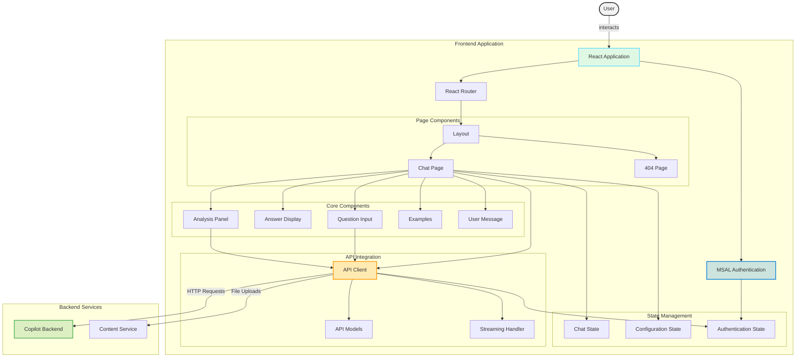

# Frontend Architecture

## Component Diagram

Mermaid Diagram

```mermaid
flowchart TB
    User([User]) --interacts--> ReactApp

    subgraph "Frontend Application"
        ReactApp[React Application]
        Router[React Router]
        MsalAuth[MSAL Authentication]

        subgraph "Page Components"
            Layout[Layout]
            ChatPage[Chat Page]
            NoPage[404 Page]
        end

        subgraph "Core Components"
            QuestionInput[Question Input]
            AnswerDisplay[Answer Display]
            AnalysisPanel[Analysis Panel]
            Examples[Examples]
            UserMessage[User Message]
        end

        subgraph "State Management"
            ChatState[Chat State]
            ConfigState[Configuration State]
            AuthState[Authentication State]
        end

        subgraph "API Integration"
            ApiClient[API Client]
            Models[API Models]
            Streaming[Streaming Handler]
        end

        ReactApp --> Router
        ReactApp --> MsalAuth
        Router --> Layout
        Layout --> ChatPage
        Layout --> NoPage

        ChatPage --> QuestionInput
        ChatPage --> AnswerDisplay
        ChatPage --> AnalysisPanel
        ChatPage --> Examples
        ChatPage --> UserMessage

        ChatPage --> ChatState
        ChatPage --> ConfigState
        ChatPage --> ApiClient

        QuestionInput --> ApiClient
        AnalysisPanel --> ApiClient

        ApiClient --> Models
        ApiClient --> Streaming
        MsalAuth --> AuthState
        ApiClient --> AuthState
    end

    subgraph "Backend Services"
        CopilotBackend[Copilot Backend]
        ContentService[Content Service]
    end

    ApiClient --HTTP Requests--> CopilotBackend
    ApiClient --File Uploads--> ContentService

    style ReactApp fill:#61dafb33,stroke:#61dafb,stroke-width:2px
    style MsalAuth fill:#0078d733,stroke:#0078d7,stroke-width:2px
    style ApiClient fill:#ff950033,stroke:#ff9500,stroke-width:2px
    style CopilotBackend fill:#4caf5033,stroke:#4caf50,stroke-width:2px
    style User fill:#f2f2f2,stroke:#333,stroke-width:2px
```

